<div align="center">


# OVI — Intelligent Money-Trail Tracing & Predictive Cashout Interdiction Platform

**An end-to-end intelligence system for Law Enforcement Agencies (I4C) and Banks that combines multi-hop graph money-trail tracing with predictive analytics to forecast and interdict cybercrime cashouts before funds vanish.**

[](https://typescriptlang.org)
[](https://react.dev)
[](https://tailwindcss.com)
[](https://fastapi.tiangolo.com)
[](https://neo4j.com)
[](https://www.hyperledger.org/projects/fabric)
[](https://www.sih.gov.in)
[](LICENSE)

</div>

> **Ovi** (*ओवी*) is a traditional poetic meter that weaves connected verses together. 
> In cybercrime forensics, **Ovi weaves the complete thread**: it traces stolen funds **backwards** across complex multi-hop mule networks to identify criminal syndicates, and forecasts money flow **forwards** in real time — pinpointing exact cash-out locations, time windows, and withdrawal channels before the money disappears.

---

### 💡 Executive Summary for Evaluators

| The Challenge | The OVI Innovation | Measurable Impact |
|:---|:---|:---|
| **Speed Mismatch**: Cyber fraud money is layered across multiple mule accounts and withdrawn at ATMs within **30–120 minutes**. Traditional investigations take days or weeks. | **Proactive Cash-Out Forecasting**: Shifts investigation from post-mortem recovery to forward prediction — forecasting likely cashout venues, time windows, and prioritized freeze recommendations while funds are still in transit. | **From Post-Mortem to Prevention**: Law enforcement and banks receive ranked freeze recommendations and physical ATM dispatch alerts while funds are still reachable. |
| **Privacy Regulations**: Banks cannot legally share raw customer transactions with third parties under DPDP Act 2023. | **Zero-PII Federated & Tokenised Graph**: Only cryptographically tokenised identifiers and local gradient signals are shared; raw PII never leaves bank firewalls. | **100% Regulatory Compliance**: Fully aligned with DPDP Act 2023 (§17), RBI FREE-AI guidelines, and MHA CFCFRMS SOP. |
| **Evidentiary Integrity**: Digital tracing outputs are easily contested in court without verifiable provenance. | **Permissioned Blockchain Chain of Custody**: Every prediction, freeze recommendation, and FIR bundle is hash-anchored to Hyperledger Fabric. | **Tamper-Evident Evidence**: Complete, court-admissible cryptographic audit trail from complaint to recovery. |

---

## 📑 Table of Contents

- [📌 Problem Statement (SIH 26184)](#-problem-statement-sih-26184)
- [✨ Core Capabilities](#-core-capabilities)
- [🔐 Five Non-Negotiable Architectural Principles](#-five-non-negotiable-architectural-principles)
- [🧠 How It Works](#-how-it-works)
- [🏗️ End-to-End Architecture](#️-end-to-end-architecture)
- [🎚️ Confidence Tiers (Honest Degradation)](#️-confidence-tiers-honest-degradation)
- [🔬 The AI & Machine Learning Pipeline](#-the-ai--machine-learning-pipeline)
- [🛡️ Privacy, Legal & Regulatory Compliance](#️-privacy-legal--regulatory-compliance)
- [⛓️ Blockchain Chain of Custody](#️-blockchain-chain-of-custody)
- [🖥️ Interactive Operator Console & Screenshots](#️-interactive-operator-console)
- [🎯 Walkthrough: A Live Investigation](#-walkthrough-a-live-investigation)
- [⚙️ Tech Stack](#️-tech-stack)
- [🚀 Quick Start Guide](#-quick-start-guide)
- [📊 Implementation Milestones & Readiness](#-implementation-milestones--readiness)
- [🛣️ Phased Production Rollout](#️-phased-production-rollout)
- [👥 Team RyzenUp](#-team-ryzenup)
- [📄 License](#-license)

---

## 📌 Problem Statement: SIH 26184

| Field | Detail |
|---|---|
| **Organization** | Ministry of Home Affairs (MHA), Govt. of India / Indian Cyber Crime Coordination Centre (I4C) |
| **Theme** | Blockchain & Cybersecurity |
| **Category** | Software |
| **Problem Title** | Cashout Forecasting and Proactive Interdiction in Cybercrime Financial Networks |

Cyber fraud in India operates at machine speed: the moment a victim's money lands in an initial beneficiary account, automated scripts distribute it across secondary and tertiary mule layers, converting it to cash via ATMs, crypto rails, or digital wallets within hours of the incident.

**Ovi flips the investigator's timeline from reactive reconstruction to proactive interdiction.** By ingesting complaints directly from the NCRP / 1930 portal, Ovi traces the active mule chain and generates high-confidence forecasts of *where, when, and how* the cashout will occur — enabling banks to freeze high-yield mule nodes and police field units to interdict cashout points in real time.

> ℹ️ **Ecosystem Integration**: Ovi is purpose-built to augment and integrate into existing infrastructure (CFCFRMS, Bank EFRMS, RBIH MuleHunter.ai, and NPCI risk feeds) by adding a geographic-temporal prediction and automated decision layer.

---

## ✨ Core Capabilities

### 1. 🕸️ Multi-Hop Money-Trail Graph Engine
- **Neo4j Cypher Traversal**: Sub-second graph queries tracing fund cascades up to 5 hops deep within 30-day sliding temporal windows.
- **Syndicate & Ring Detection**: Automated identification of hub-and-spoke mule rings, shared device clusters, and ATM convergence patterns.
- **Interactive Force-Directed Canvas**: Visual graph explorer with node clustering, path replay, and community hulls for investigators.

### 2. ⏱️ Predictive Interdiction Clock
- **Time-to-Cashout (TTC) Survival Model**: Gradient-boosted survival analysis calculating P10, P50, and P90 time horizons from initial deposit to first withdrawal.
- **Live Urgency Countdown**: Mission-critical countdown timers for each active case, triaging cases by time left before money leaves the banking system.

### 3. 🤖 Hybrid Graph-AI Mule Scoring
- **Inductive GraphSAGE + XGBoost**: Inductive neighborhood graph neural networks combined with gradient boosting for cold-start and active accounts.
- **Local Isotonic Calibration**: Eliminates raw probability distortion so a 0.85 score corresponds directly to an 85% empirical risk.
- **Transparent SHAP Attribution**: Instant explainability panels detailing *why* an account was flagged (velocity spike, dormancy breach, device-sharing).

### 4. 🎚️ Calibrated Confidence Tiers (Honest Degradation)
- **T1 (Exact ATM)**: Pinpoint ATM geo-coordinates with field-dispatch CCTV pull codes.
- **T2 (District Zone)**: High-probability police district ring when micro-location signal is sparse.
- **T3 (Rail Mix)**: Channel probability distribution (ATM vs. Wallet vs. UPI vs. Crypto) when accounts lack debit cards.
- **T4 (Watchlist)**: Automated monitoring queue that self-promotes upon fresh transactional evidence.
- *The platform never invents artificial precision.*

### 5. 🔒 Expected-Recoverable Freeze Priority Queue
- **Mathematical Value-at-Risk Ranking**: Accounts are sorted by `Recoverable Amount = Balance × P(mule)`, ensuring investigators target maximum financial recovery first.
- **CFCFRMS Draft Automation**: One-click generation and dispatch of freeze and lien requests adhering to MHA standard operating procedures with active SLA tracking.

### 6. ⛓️ Court-Admissible Blockchain Evidence
- **Hyperledger Fabric Channels**: Immutable cryptographic anchoring of case milestones, forecast digests, and bank freeze actions.
- **FIR-Ready Digital Evidence Bundles**: Instant compilation of complete case files, Cypher graph snapshots, and transaction ledgers with on-chain verification stamps.

---

## 🔐 Five Non-Negotiable Architectural Principles

1. **Raw Financial Data Never Leaves the Bank**: Distributed federated learning architecture keeps customer PII and raw statements within the bank’s security perimeter.
2. **Honest Confidence Degradation**: System outputs explicitly tier down in granularity if graph density is low, preventing false dispatches.
3. **Mandatory Human-in-the-Loop Oversight**: No autonomous account freezes. Ovi generates calibrated, prioritized recommendations; formal lien actions remain strictly with authorized bank and police officers.
4. **Immutable Chain of Custody**: Every model inference, alert dispatch, and case update is hash-anchored to Hyperledger Fabric for legal admissibility in judicial trials.
5. **Full Compliance with Indian Law**: Grounded in Section 17 of the Digital Personal Data Protection (DPDP) Act 2023, the RBI FREE-AI Framework, and MHA CFCFRMS SOPs.

---

## 🧠 How It Works

From complaint ingestion to actionable field interdiction:

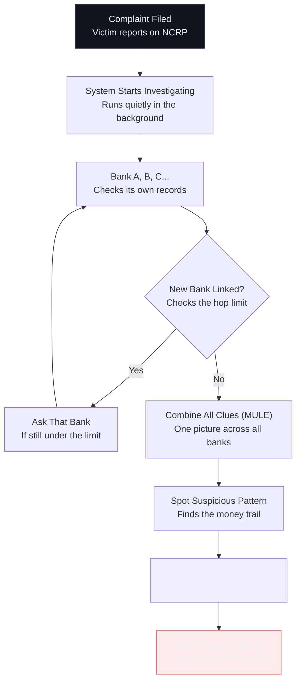

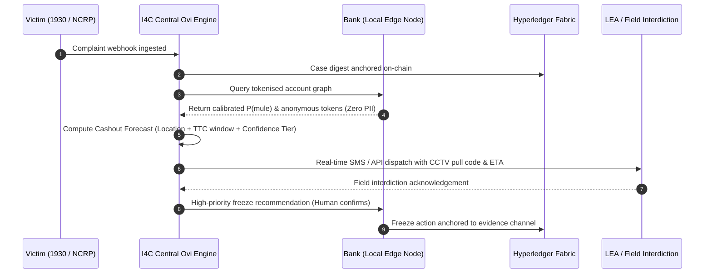

---

## 🚧 Feasibility & Viability

- **Feasibility**: Built on mature, proven technologies (Neo4j, XGBoost, Kafka). The prototype is feasible with 2-3 partner banks. The main blocker is bank policy, not engineering constraints.
- **Challenges & Mitigation**:
  - **Banks won't share raw data** → Tokenize at source before it leaves the bank.
  - **Risk of wrongful account freeze** → Explainable predictions; human intervention.
  - **Legal defensibility of predictions** → Append-only audit ledger of every action.

---

## 🏗️ End-to-End Architecture

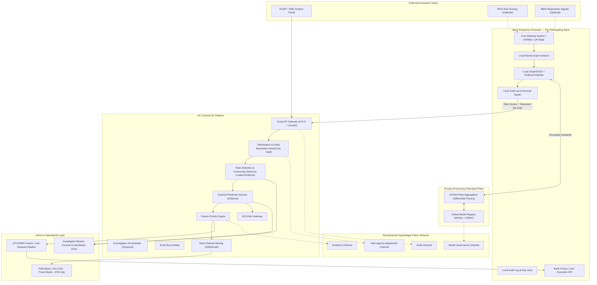

---

## 🎚️ Confidence Tiers: Honest Degradation

A core failure mode of legacy predictive tools is overpromising precision on sparse data. Ovi implements **Honest Degradation**: the system will never fabricate an ATM-level prediction if the underlying graph signals only justify a district-level or rail-level alert.

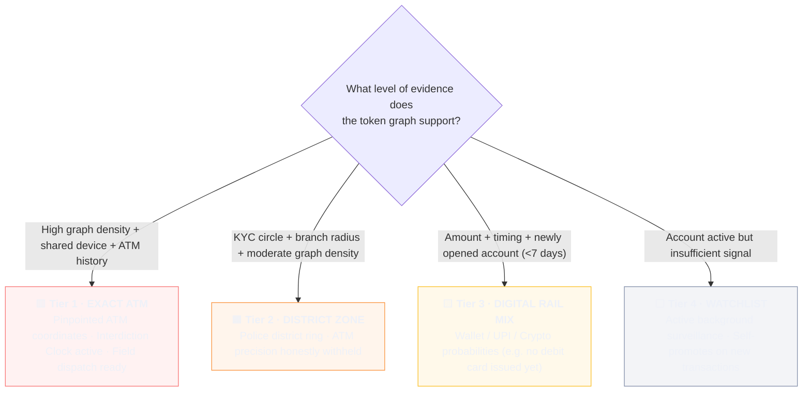

---

## 🔬 The AI & Machine Learning Pipeline

### 1. Hybrid ML Mule Scoring (Leiden + XGBoost)
- **Community Detection (Leiden/Louvain)**: Discovers highly connected clusters of accounts passing funds among each other, flagging entire mule networks simultaneously.
- **Tabular Velocity Features**: Integrates transaction burst frequency, dormancy interval breaches, in/out flow velocity ratios, KYC status, and phone-circle mismatches.
- **Isotonic Calibration**: Calibrates probabilities on empirical holdouts to prevent overconfident false positives.

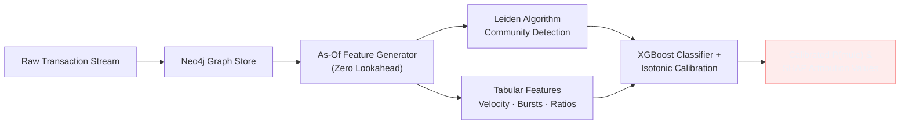

### 2. Time-to-Cashout (TTC) Survival Analysis
Rather than treating withdrawal timing as a static classification problem, Ovi models it as a **continuous survival function** (deposit → first withdrawal event).
- Emits accurate **P10, P50 (median), and P90 confidence bounds**.
- Drives the visual **Interdiction Clock** so commanders know the exact tactical window remaining.

### 3. Geospatial ATM Hotspot Ranker
Predicts the exact withdrawal venue using a weighted multi-factor scoring function:

$$\text{Score}(\text{ATM}) = w_1 \cdot \text{Traffic}_{\text{recency}} + w_2 \cdot P(\text{mule})_{\text{mean}} + w_3 \cdot \text{Prior}_{\text{fraud}} + w_4 \cdot \text{Decay}(\text{distance}) + w_5 \cdot \text{Fit}(\text{amount})$$

---

## 🛡️ Privacy, Legal & Regulatory Compliance

Ovi is engineered to satisfy the highest standard of Indian cyber jurisprudence and privacy mandates:

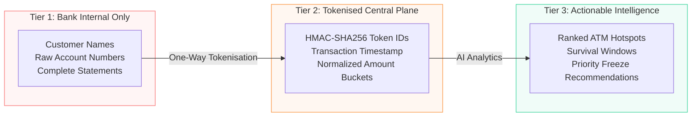

| Regulatory Framework | Mandatory Requirement | How OVI Complies |
|:---|:---|:---|
| **DPDP Act 2023 (§17)** | Exemptions for prevention, detection, and investigation of criminal offences. | Lawful legal basis for processing cross-institutional transaction metadata. |
| **DPDP Act 2023 (General)** | Purpose specification, data minimisation, storage limitation. | Zero raw PII leaves the bank; all central telemetry is cryptographically tokenised. |
| **Karnataka HC PhonePe Ruling** | Privacy yields to lawful criminal fraud investigations. | Establishes jurisprudence for inter-bank data coordination under law enforcement supervision. |
| **RBI FREE-AI Framework (2025)** | Fairness, Resilience, Ethics, Explainability, Human Oversight. | Granular SHAP attribution per prediction; zero autonomous freezes; mandatory human sign-off. |
| **MHA CFCFRMS SOP (2026)** | Proportionate account liens; prevention of undue financial disruption. | Freeze priority strictly ordered by expected recoverable amount; instant audit logs. |

---

## 💡 Impact and Benefits

| Domain | Impact |
|:---|:---|
| **National / System** | Scales to 8000+ cases/day with a proactive response. |
| **Banks** | No raw data shared; reduces fraud liability. |
| **Citizens / Victims** | Faster fund recovery; more trust to report. |
| **Law Enforcement** | Fast, exact leads with a clear audit trail. |
| **Macro Impact** | Protects the economy and boosts cybersecurity. |
| **Digital Trust** | Greater public trust and inter-bank trust. |
| **Regulators** | Sets sharing norms and ensures easier compliance. |

---

## ⛓️ Blockchain Chain of Custody

Ovi utilizes a permissioned **Hyperledger Fabric** network to anchor hashes of all critical operations. **No sensitive customer or transactional data is ever written to the ledger** — only one-way cryptographic SHA-256 digests.

| Channel | Recorded Payload | Operational & Judicial Purpose |
|:---|:---|:---|
| **Audit Channel** | Case creation, risk recalculations, alert dispatches | Tamper-evident operational timeline for supervisory oversight |
| **Evidence Channel** | FIR report digests, graph state snapshots, freeze timestamps | Court-admissible chain of custody under Indian Evidence Act §65B |
| **Model Governance** | Model weights hashes, training data provenance, deployment records | Guarantees algorithmic reproducibility under RBI FREE-AI standards |
| **Agreement Channel** | Inter-bank data sharing agreements, access consent tokens | Non-repudiable institutional consensus between banks and I4C |

---

## 🖥️ Interactive Operator Console

The Ovi console is a production-grade operational command center (React 18 + TypeScript + Tailwind CSS) with full keyboard accessibility (`1–8` shortcuts), real-time WebSockets, and a multi-speed simulation clock (`1× / 20× / 120×`):

| View | Module | Operational Utility |
|:---|:---|:---|
| **01** | **Executive Overview** | Real-time KPIs: active cases, funds at risk, recoverable amounts, confidence distribution, and live event feed |
| **02** | **Complaints Queue** | Ingested NCRP / 1930 incident files with case drill-downs and quick action links |
| **03** | **Graph Analysis** | Interactive force-directed canvas displaying tokenised money trails, community hulls, and animated transaction replays |
| **04** | **Mule Detection** | Federated risk score rankings with interactive SHAP factor breakdowns for every flagged node |
| **05** | **Cashout Forecast** | Active Interdiction Clock countdowns, GIS hotspot map, ranked ATM coordinates, and channel rail mixes |
| **06** | **Freeze Priority** | Expected recoverable queue (`Balance × P(mule)`), automated CFCFRMS draft generation, and bank SLA timers |
| **07** | **Alert Dispatch** | Dispatch control matrix across SMS, Email, and Bank API webhooks with delivery acknowledgement logs |
| **08** | **Model Assurance** | Calibration reliability curves, rolling AUC trends, PSI feature drift heatmaps, and versioned model registry |

---

### 📸 Operational Screenshots

<div align="center">

#### 01 · Executive Overview — Real-Time Interdiction Command
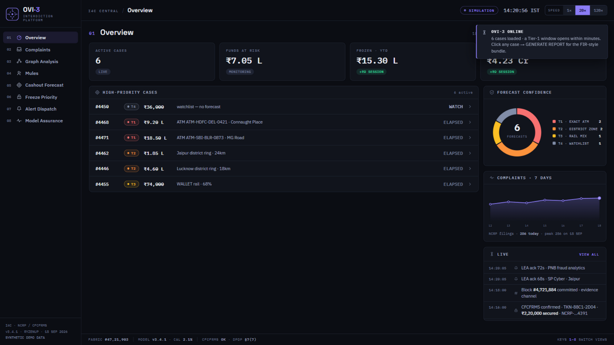

#### 05 · Cashout Forecast — Live Interdiction Clock, GIS Map & ATM Ranking
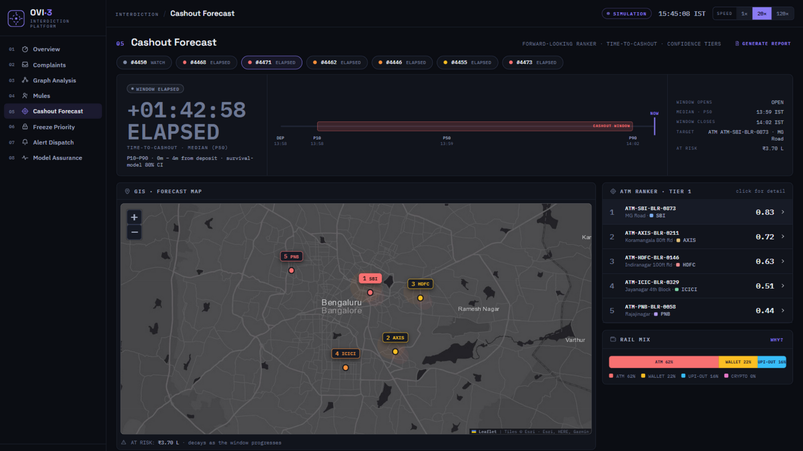

#### 03 · Graph Analysis — Multi-Hop Tokenised Money Trail & Replay
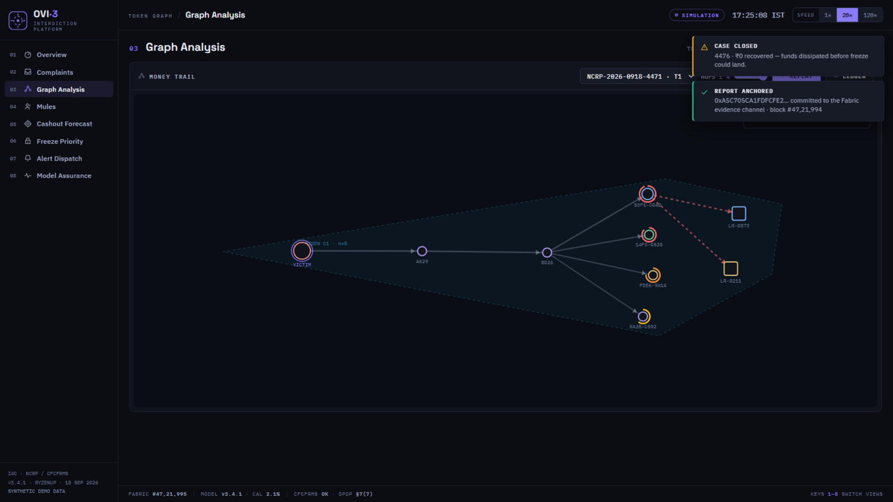

#### 04 · Mule Intelligence — Calibrated Risk Scoring with SHAP Explainability
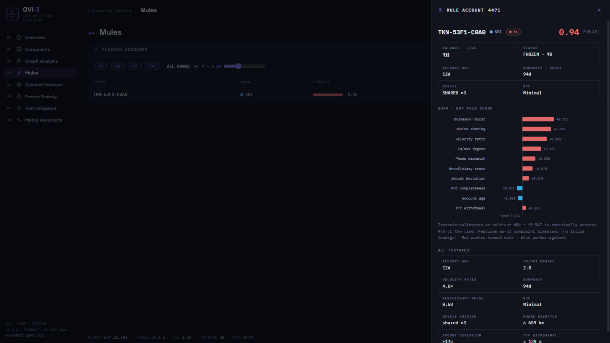

#### 06 · Freeze Priority — CFCFRMS Queue with Expected Recoverable ₹ & SLA Timers
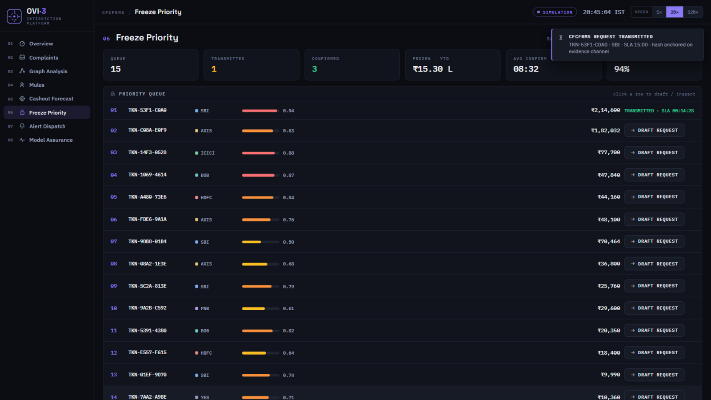

#### 07 · Alert Dispatch — Cross-Agency Multi-Channel Delivery Chains
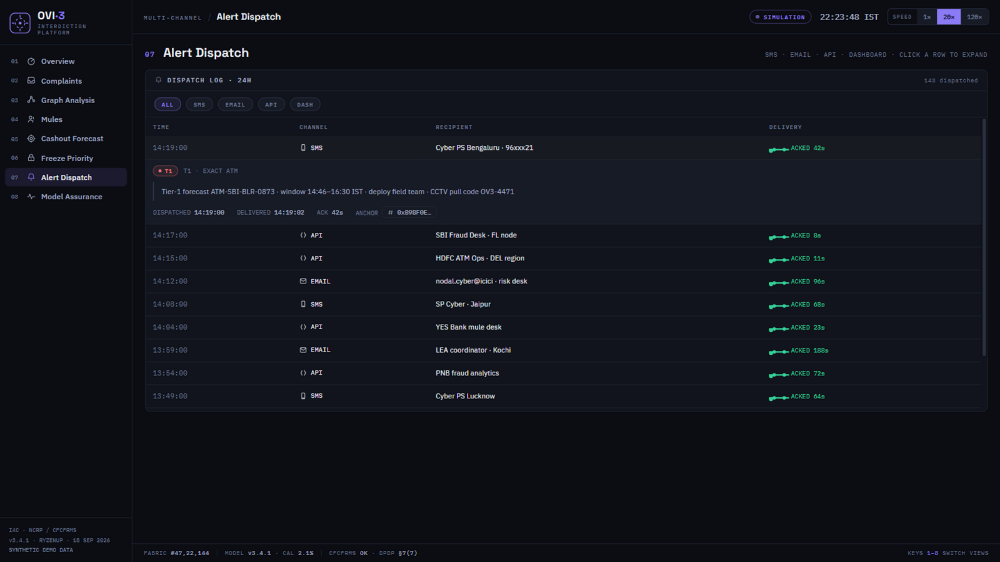

#### Evidence Bundle — FIR-Style Investigation Report Anchored to Fabric
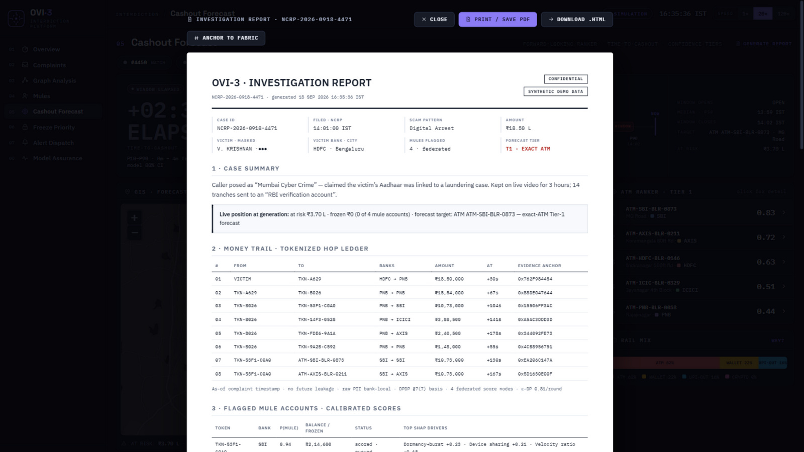

</div>

---

### 🕸️ Cypher Graph Traversal in Neo4j

Investigating officers can execute live graph queries against the backend Neo4j cluster:

#### 1. Single Complaint Fraud Chain
Traces the victim's funds hop-by-hop through intermediary mule accounts to the terminal ATM cashout.

```cypher
MATCH path = (c:Complaint)-[:VICTIM_OF]->(v:Account)
             -[:TRANSFERRED]->(m:Account)
             -[:WITHDREW_AT]->(atm:ATM)
RETURN path LIMIT 1
```
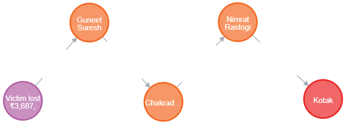

#### 2. Mule Network Hub-and-Spoke Mesh
Uncovers automated distribution networks where stolen funds are divided among secondary mules.

```cypher
MATCH path = (a:Account {is_mule: true})-[:TRANSFERRED]->(b:Account {is_mule: true})
RETURN path LIMIT 60
```
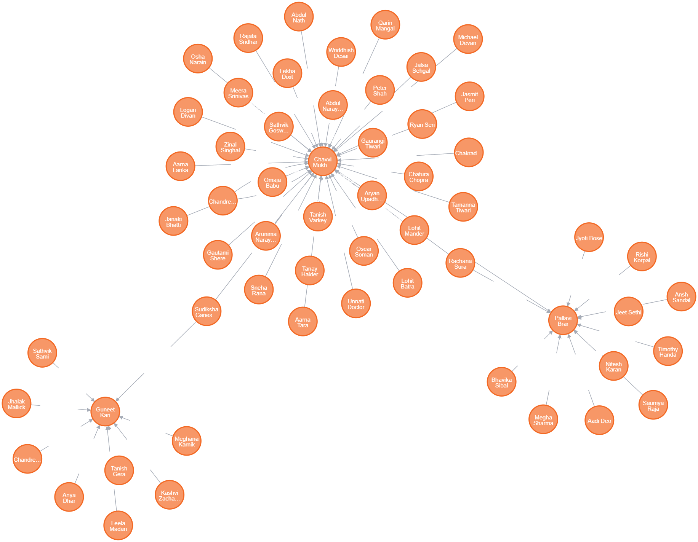

#### 3. ATM Hotspot Convergence
Detects multiple unrelated mule accounts converging on a single suspicious ATM location.

```cypher
MATCH path = (a:Account)-[:WITHDREW_AT]->(atm:ATM {is_suspicious: true})
RETURN path LIMIT 40
```
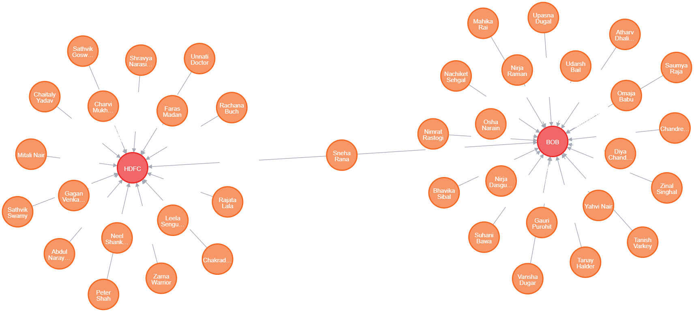

---

### ⚡ Interactive OpenAPI Backend (FastAPI)

Interactive API documentation available at `http://localhost:8000/docs`:

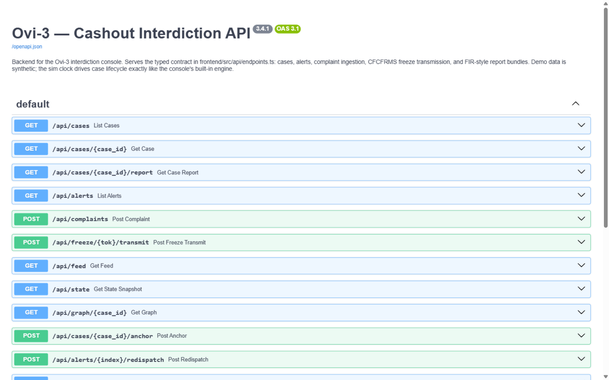

**`GET /api/cases` executing live — sorted automatically by urgency and recoverable amount:**

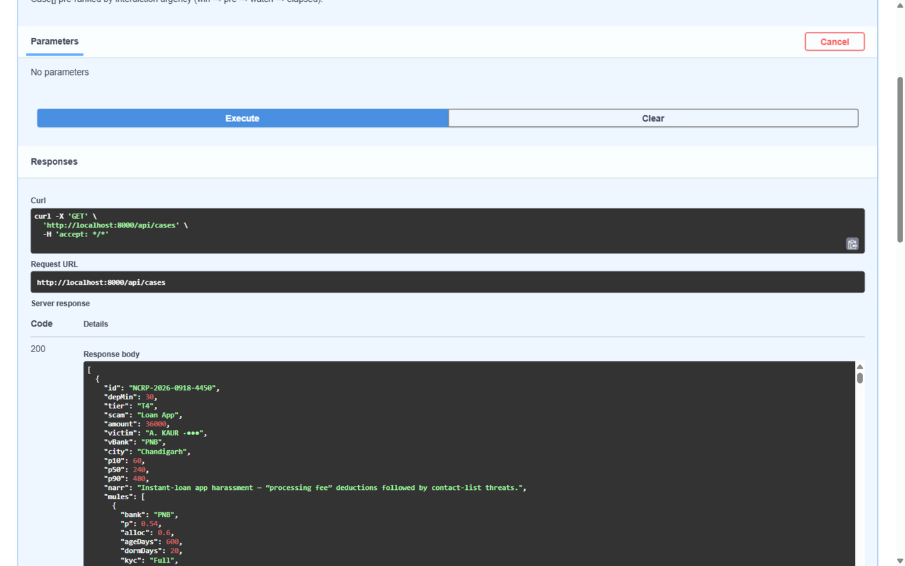

---

## 🎯 Walkthrough: A Live Investigation

**Incident**: Case `NCRP-2026-0918-4471` · Digital Arrest Scam · ₹18,50,000 · Bengaluru

```
[T + 00:00]  NCRP 1930 complaint ingested. Case hash-anchored to Fabric Audit Channel in 1.8s.
[T + 00:04]  Neo4j graph resolves victim's ₹18.5L siphoned across 2 hops into 4 distinct mule accounts.
[T + 00:09]  Federated AI computes calibrated risk: P(mule) = 0.94, 0.88, 0.76, 0.61.
[T + 00:13]  High graph density + shared device detected -> Tier 1 (Exact ATM) forecast triggered:
             Target: ATM-SBI-BLR-0873 (MG Road, Bengaluru) with Composite Score 0.83.
[T + 00:15]  TTC Survival Model establishes interdiction window: 26m – 4h 10m from deposit (Median ~2h).
             Live Interdiction Clock countdown begins on dashboard.
[T + 00:17]  Freeze Priority Queue ranks primary mule at ₹12,80,000 Expected Recoverable (Balance × 0.94).
             Investigator drafts and dispatches CFCFRMS freeze notice with one click.
[T + 00:19]  Alerts dispatched simultaneously:
             • Cyber Police Station Bengaluru (SMS + Secure Telegram alert)
             • SBI Fraud Operations Desk (Automated API Webhook)
             • Field Interdiction Team (CCTV Pull Code: OV3-4471)
[T + 00:22]  Investigator generates full FIR-ready evidence dossier, anchored with cryptographic proof.
```

*If the target mule was a newly opened account (<7 days) without a physical debit card, Ovi’s honest degradation automatically shifts to **Tier 3 (Rail Mix)**, warning teams that cashout will likely route through digital wallets or agent networks rather than misdirecting police to an ATM.*

---

## ⚙️ Tech Stack

| Domain | Technology | Operational Justification |
|:---|:---|:---|
| **Graph Database** | **Neo4j Enterprise** | Sub-second Cypher queries across multi-hop directed transaction graphs |
| **Community Detection** | **Leiden Algorithm** | Finds groups of accounts working together as mule rings |
| **Machine Learning** | **XGBoost + SHAP** | Mule classification and cashout prediction with explainability |
| **Backend Framework** | **FastAPI (Python 3.12)** | Asynchronous REST endpoints, auto OpenAPI generation, and WebSocket hub |
| **Relational Database** | **PostgreSQL** | ACID-compliant storage for complaints, account metadata, and local txn stores |
| **API Gateway** | **Kong & OAuth2** | Secure entry point, mutual authentication (mTLS) |
| **Event Bus** | **Kafka** | Real-time data streaming and event-driven alerts |
| **Orchestrator** | **Temporal** | Durable workflow orchestration for multi-bank investigations |
| **Secrets & Tokens** | **HashiCorp Vault** | HMAC-based tokenization and secure key management |
| **Federated Learning** | **NVIDIA Flare** | Secure gradient aggregation with differential privacy guarantees |
| **Model Registry** | **MLflow** | Versioning, reproducibility, and model lifecycle management |
| **Frontend & GIS** | **React 18 + TS + Leaflet** | Type-safe mission console and real-time GIS rendering |

---

## 🚀 Quick Start Guide

### Prerequisites
- Node.js 18+ & npm
- Python 3.11+ & [uv](https://docs.astral.sh/uv/) (or pip)

### 1. Clone Repository
```bash
git clone https://github.com/Pranav-Pardeshii/Ovi-V3.git
cd Ovi-V3
```

### 2. Frontend Mission Console
```bash
cd frontend
npm install
npm run dev
```
Open **`http://localhost:5173`** in your browser:
- Press keys **`1` through `8`** to switch between views.
- Toggle the **simulation clock** (`1× / 20× / 120×`) in the top navigation bar.
- Click any case row → **Generate Report** to inspect and download the court-admissible FIR dossier.
- Navigate to **Freeze Priority** to test drafting and transmitting a CFCFRMS lien request.

### 3. Asynchronous Backend API
```bash
cd ../backend
uv sync                                            # installs dependencies in .venv
uv run uvicorn app.main:app --reload --port 8000
```
- Interactive OpenAPI (Swagger) documentation: **`http://localhost:8000/docs`**
- WebSocket live event stream: **`ws://localhost:8000/ws`**

---

## 📊 Implementation Milestones & Readiness

| Milestone | Status | Description |
|:---|:---:|:---|
| **Mission Console (8 Views)** | ✅ Ready | Complete React 18 + TypeScript operational console with real-time UI states |
| **Interactive Simulation Engine**| ✅ Ready | End-to-end case lifecycles, dynamic spawns, freeze confirmations, and SLA counters |
| **FIR Investigation Dossier** | ✅ Ready | Court-admissible print/download bundle with simulated Fabric proof digest |
| **FastAPI Core & WebSockets** | ✅ Ready | Asynchronous API gateway with typed schemas and live socket broadcast |
| **Neo4j Money-Trail Graph** | ✅ Ready | Cypher query schemas for single-complaint chains, mule rings, and ATM hotspots |
| **RNG Seed Parity (TS ↔ Python)**| ✅ Ready | Parity-verified pseudo-random simulation engines across frontend and backend |
| **Relational Schemas** | ✅ Ready | PostgreSQL entity schemas for complaints, accounts, and ATM nodes |
| **Production Model Training** | 📋 Roadmap | Training GraphSAGE + XGBoost on large-scale banking consortium datasets |
| **Hardware Anchor Integration** | 📋 Roadmap | Direct deployment to live Hyperledger Fabric production peer nodes |
| **CFCFRMS / NCRP Production API**| 📋 Roadmap | Direct connectivity with MHA I4C production webhooks |

---

## 🚀 Future Scope & Features

- **Beyond ATMs**: Cover digital wallets and merchant cash-outs.
- **Onboard Banks**: Start with a few banks, and expand over time.
- **Deepen the Network**: Raise hop depth and add more banks over time.
- **Launch Mobile App**: Instant alerts for field officers.
- **National Rollout**: RBI/I4C mandate for all banks & NBFCs.
- **Upgrade to GNN**: Upgrade to GraphSAGE (GNN) + XGBoost for richer inductive embeddings.

---

## 📚 Research and References

- **National Cybercrime Reporting Portal (NCRP)** — I4C, MHA
- **Citizen Financial Cyber Fraud Reporting and Management System (CFCFRMS)**
- **Weber et al. (2019)** — Anti-Money Laundering in Bitcoin: GCN for Financial Forensics
- **SBC 2023** — Graph Neural Networks Applied to Money Laundering Detection
- **Bonato & Szava** — Network Embedding Analysis for AML Detection
- **Federated ML for Cross-Bank CC Fraud Detection (2025)**
- **J.P. Morgan / Kinexys, BNY, RBC, NVIDIA** — Project Aikya (2025)
- **Bharatiya Nagarik Suraksha Sanhita (BNSS), 2023** — Section 94: The Legal Authority to Demand Data

---

## 👥 Team RyzenUp

| Role | Core Responsibilities |
|:---|:---|
| **Team Lead & System Architect** | End-to-end architecture, system design, and pilot coordination |
| **AI / Graph ML Specialist** | GraphSAGE GNN, XGBoost calibration, and TTC survival model |
| **Backend & Distributed Systems** | FastAPI architecture, Neo4j graph schemas, and federated learning plane |
| **Frontend & Geospatial Engineer**| Interdiction mission console, GIS heatmap engine, and canvas visualizations |
| **Blockchain & Security Engineer** | Hyperledger Fabric channels, cryptographic hash anchoring, and chaincode |
| **Data Governance & Legal Compliance**| Dataset engineering, DPDP Act 2023 alignment, and MHA SOP compliance |

---

## 📄 License

This project is licensed under the [MIT License](LICENSE). Built with pride for **Smart India Hackathon 2026 — Problem Statement 26184** under the Ministry of Home Affairs (MHA), Government of India.

---

<div align="center">

**ओवी · OVI**  
*Turning reactive investigation into proactive interdiction.*

</div>
