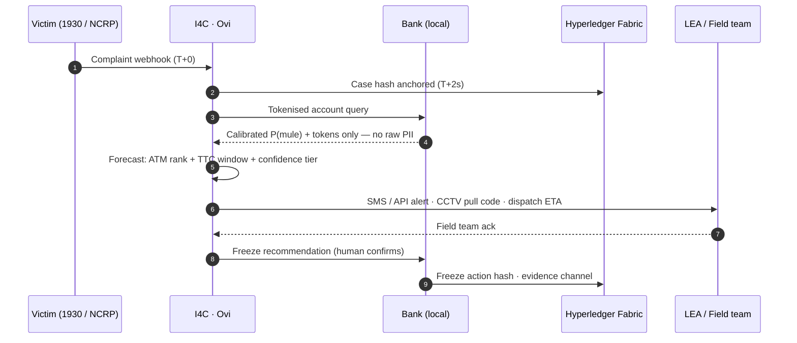
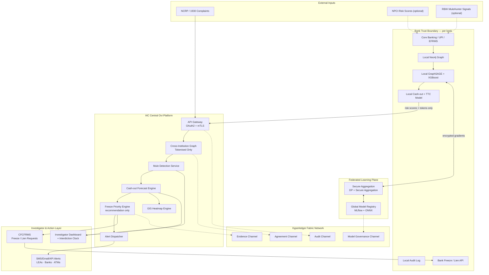
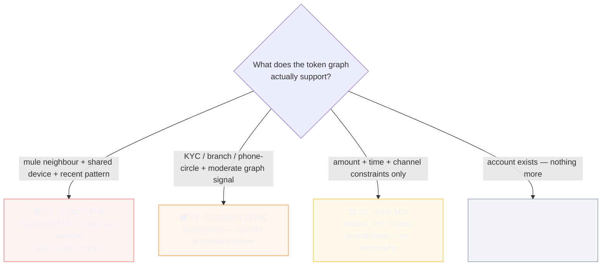
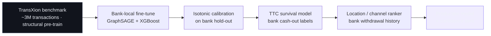
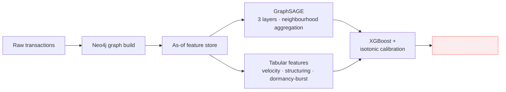
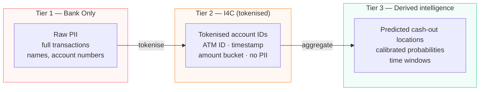
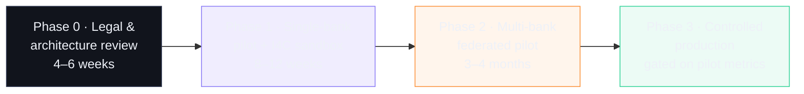

<div align="center">


# OVI — Cashout Interdiction Platform

**Predictive analytics that forecasts where and when cybercrime money will be withdrawn — while it is still reachable.**

[](https://typescriptlang.org)
[](https://react.dev)
[](https://tailwindcss.com)
[](https://fastapi.tiangolo.com)
[](https://neo4j.com)
[](https://www.hyperledger.org/projects/fabric)
[](https://www.sih.gov.in)
[](LICENSE)

</div>

> **Ovi** is a form of traditional Marathi poetry.
> [Ovi-V2](https://github.com/Pranav-Pardeshii/Ovi-V2) traced the thread of stolen money *backwards* — from victim to mule to ATM.
> **Ovi follows it *forwards*** — forecasting the likely cash-out location, time window, and channel before the money disappears.

---

## 📑 Table of Contents

- [📌 Problem Statement](#-problem-statement-sih-26184)
- [🔐 Five Non-Negotiable Principles](#-five-non-negotiable-principles)
- [✨ Key Features](#-key-features)
- [🧠 How It Works](#-how-it-works)
- [🏗️ Architecture](#️-architecture)
- [🎚️ Confidence Tiers](#️-confidence-tiers--honest-degradation)
- [🔬 The ML Pipeline](#-the-ml-pipeline)
- [🛡️ Privacy & Compliance](#️-privacy--compliance)
- [⛓️ The Blockchain Layer](#️-the-blockchain-layer)
- [🖥️ The Dashboard & Screenshots](#️-the-dashboard)
- [🎯 Example Investigation](#-example-investigation)
- [⚙️ Tech Stack](#️-tech-stack)
- [🚀 Getting Started](#-getting-started)
- [📊 Project Status](#-project-status)
- [🛣️ Phased Rollout](#️-phased-rollout)
- [⚠️ Current Limitations](#️-current-limitations)
- [🗺️ Roadmap](#️-roadmap)
- [👥 Team](#-team-ryzenup)
- [📄 License](#-license)

---

## 📌 Problem Statement: SIH 26184

| | |
|---|---|
| **Organization** | Ministry of Home Affairs (MHA), Govt. of India |
| **Theme** | Blockchain & Cybersecurity |
| **Category** | Software |

Cybercrime fraud in India moves at machine speed: the moment a victim's money lands in a mule account, it is stripped across layers of accounts and withdrawn through ATMs, wallets, and UPI rails — often within hours of the complaint being filed. By the time investigators begin tracing, the funds are gone.

**Ovi flips the timeline.** After a complaint arrives on the NCRP/1930 portal, it forecasts the *likely cash-out locations, time windows, and channels* while funds are still cascading through mule accounts — giving I4C investigators, banks, and field teams a concrete window to act instead of a trail to reconstruct.

> ⚠️ **Ovi does not replace CFCFRMS, bank EFRMS, RBIH MuleHunter.ai, or NPCI risk scoring.** It adds a proactive geographic-and-temporal prediction layer on top of them.

---

## 🔐 Five Non-Negotiable Principles

1. **Raw data never leaves the bank** — federated learning architecture, local inference only.
2. **Predictions are calibrated and tiered** — confidence tiers with honest degradation; never fabricate ATM-level precision.
3. **Every material action is human-reviewed and auditable** — Hyperledger Fabric hash anchoring plus mandatory investigator/bank override.
4. **No autonomous freezes** — Ovi produces ranked recommendations only; freeze and lien authority stays with the bank and LEA under the MHA CFCFRMS SOP.
5. **Legal basis is explicitly scoped** — DPDP Act 2023 §17 (prevention / detection / investigation of offences) with existing powers under CrPC/BNSS and bank regulatory obligations.

---

## ✨ Key Features

- 🔎 **Neo4j money-trail traversal** — Cypher graph search up to 5 hops from the victim inside a 30-day temporal window, with mule-ring and ATM-convergence queries.
- 🤖 **XGBoost mule detection** — binary classifier over combined graph + relational features (degree ratios, KYC status, account age, velocity), calibrated per prediction.
- 🏧 **ATM hotspot ranking** — geo-coordinates of likely cash-out locations, ranked by ML score and withdrawal volume.
- ⏱️ **Interdiction Clock** — live countdown to the predicted cash-out window (P10/P50/P90 from a survival model), with a timeline band per case.
- 🎚️ **Confidence Tiers (T1–T4)** — exact-ATM → district ring → channel mix → watchlist. The system *degrades honestly* instead of inventing precision.
- 🧮 **Calibrated P(mule)** — GraphSAGE → XGBoost → isotonic calibration, with per-prediction **SHAP attribution** ("why this score").
- ⚡ **Fully async backend** — FastAPI with auto-generated OpenAPI (Swagger) docs and a WebSocket hub for the live event feed.
- 🗄️ **Dual-database architecture** — PostgreSQL (complaints, accounts, ATMs) + Neo4j (money-trail graph).
- 🗺️ **GIS forecast map** — ATM markers, density halos, and district rings on a dark basemap, tier-aware.
- 🕸️ **Tokenised money-trail graph** — force-directed canvas with community detection, hop ledger, and animated trail replay.
- 🔒 **Freeze priority queue** — ranked by *expected recoverable amount* (balance × P(mule)), with live SLA timers and one-click CFCFRMS draft transmission.
- 📣 **Multi-channel alert dispatch** — SMS / Email / API / Dashboard with delivery-chain tracking and re-dispatch.
- 📉 **Model assurance page** — calibration reliability, rolling AUC, PSI drift heatmap, MLflow-style model registry.
- ⛓️ **On-chain evidence** — every case, forecast, freeze, and report anchored to the Fabric evidence channel; FIR-style report generation with print/download.
- 🇮🇳 **India-specific synthetic dataset** — realistic fraud patterns across 8 major cities with mule-reuse and ATM-clustering behaviour.
- 🎹 **Operator-grade console** — keyboard view switching (1–8), 1×/20×/120× simulation clock, toasts, and slide-over case files.

---

## 🧠 How It Works

From complaint to actionable interdiction window in under 20 seconds:

```mermaid
flowchart LR
    A["NCRP / 1930 complaint<br/>T+0"] --> B["Case created<br/>hash anchored · T+1–3s"]
    B --> C["Tokenised cross-bank<br/>graph resolved · T+3–8s"]
    C --> D["Federated scores return<br/>calibrated P(mule) · T+5–12s"]
    D --> E["Cash-out forecast<br/>location ranker + TTC · T+8–15s"]
    E --> F["Freeze priority ranked by<br/>expected recoverable"]
    F --> G["Alerts dispatched<br/>LEA · Bank · ATM ops · T+10–20s"]
    style A fill:#11141C,stroke:#303851,color:#EEF1F8
    style E fill:#8B7CF622,stroke:#8B7CF6,color:#EEF1F8
    style G fill:#F8717122,stroke:#F87171,color:#EEF1F8
```





### Inside each bank

Continuous local scoring on the bank's own Neo4j graph: new transactions update the graph, features are computed **as-of the complaint timestamp** (no future leakage), GraphSAGE embeds each account from its neighbours, XGBoost produces a calibrated P(mule), and only **tokenised IDs + scores** travel to I4C. Encrypted gradients flow separately to the federated aggregation plane.

### What never happens

- ❌ Raw PII or full transaction details leaving the bank
- ❌ Autonomous freezes without human confirmation
- ❌ Predictions issued without a confidence tier
- ❌ Material actions without an on-chain audit hash
- ❌ ATM-precision claims on accounts with insufficient signal

---

## 🏗️ Architecture



| Component | Why it exists | What breaks without it |
|-----------|---------------|------------------------|
| Local Neo4j (per bank) | Multi-hop tracing needs graph traversal, not SQL joins | SQL-based tracing fails on deep mule chains |
| GraphSAGE (inductive) | Embeds unseen accounts from neighbours | Tabular models fail on cold-start accounts with zero history |
| Federated learning | Banks legally cannot share raw transaction data at scale | Either privacy violation or zero cross-bank visibility |
| Hyperledger Fabric (hashes only) | Tamper-evident, court-admissible chain of custody | Predictions lack defensible provenance |
| Calibrated tiers | Uncalibrated scores mislead investigators and cause false freezes | Loss of operational trust |

---

## 🎚️ Confidence Tiers — Honest Degradation

The system's most important design rule: **it never fabricates precision.** The tier is decided by what the graph signal can actually support:



Cold-start is handled explicitly: accounts younger than ~7 days have no debit card, so the model shifts probability from the ATM rail to **wallet / agent cash-in networks** rather than guessing a location. The console renders the empirical rail mix (ATM / wallet / UPI / crypto) for every case.

---

## 🔬 The ML Pipeline

### Transfer learning strategy



TransXion teaches the *structural grammar* of mule networks (dormancy→burst, velocity spikes, fan-out). Bank-local data teaches *Indian UPI mule behaviour*, ATM usage, and realistic time-to-cashout distributions. Neither alone is sufficient.

### Mule detection: GraphSAGE → XGBoost hybrid



**Core features (illustrative top set):** account age · in/out degree ratios (1h/24h/7d) · velocity ratio · dormancy days before burst · beneficiary reuse · KYC status · device sharing · phone-circle mismatch · amount deviation from baseline · time-to-first-withdrawal.

### Cash-out location ranker

The ranker predicts where money will be withdrawn *next* — it does not simply rank ATMs by historical withdrawal count:

```
score(location) = w₁ · recency_weighted_mule_traffic
                + w₂ · mean_mule_probability
                + w₃ · location_fraud_prior
                + w₄ · distance_decay_from_known_addresses
                + w₅ · amount_fit
```

Weights are learned per bank from its own labelled cash-out history. **Time-to-Cashout** is a gradient-boosted survival model over deposit→first-withdrawal times, emitting a median plus an 80% confidence interval — this drives the Interdiction Clock.

---

## 🛡️ Privacy & Compliance

### Three-tier data sharing model



| Instrument | Requirement | How Ovi complies |
|------------|-------------|--------------------|
| [DPDP Act 2023 §17](https://www.dpdpact2023.com/) | Exemption for prevention / detection / investigation of offences | Primary legal basis for tokenised cross-institution processing |
| DPDP Act 2023 (general) | Purpose limitation, minimisation, safeguards | Three-tier model; AES-256 at rest, TLS 1.3 in transit; only hashes on-chain |
| Karnataka HC PhonePe ruling (2025) | Data protection yields to criminal investigation | Supports lawful LEA disclosure within statutory bounds |
| [RBI FREE-AI Framework (2025)](https://rbi.org.in/Scripts/PublicationReportDetails.aspx?ID=1306) | Transparency, accountability, explainability, human oversight | SHAP panels, confidence tiers, mandatory human freeze confirmation, model-governance channel |
| [MHA CFCFRMS SOP (2026)](https://www.livelaw.in/articles/cfcfrms-reading-mha-new-account-freeze-sop-537503) | Limited liens, grievance redressal, avoid unnecessary freezes | Recommendation-only design ranked by expected recoverable amount |
| RBI IT Governance Framework | Encryption, incident reporting | Encryption standards + real-time monitoring + on-chain audit trail |

Federated learning follows the pattern demonstrated in NPCI's federated risk-scoring pilots: banks run models locally and transmit only risk signals, with secure aggregation + differential privacy ensuring no single party can reconstruct raw data.

---

## ⛓️ The Blockchain Layer

Only **cryptographic hashes** are written on-chain — never PII, never transaction data. Four Hyperledger Fabric channels:

| Channel | Content | Purpose |
|---------|---------|---------|
| **Audit** | Prediction requests, freeze actions, case events | Tamper-evident operational audit |
| **Evidence** | FIR-ready report hashes, graph snapshot hashes | Court-admissible chain of custody |
| **Model Governance** | Model version hashes, training provenance | Regulatory compliance under FREE-AI — no silent model swaps |
| **Agreement** | Data-sharing agreements, compliance records | Inter-agency trust |

The dashboard exposes this directly: every case carries hash chips (case block, evidence bundles, pipeline steps) that copy on click, and every generated report can be **anchored to the evidence channel** in one click, producing a timestamped, tamper-evident digest for court submission.

---

## 🖥️ The Dashboard

An eight-page interdiction console (React 18 + TypeScript + Tailwind) with a built-in simulation engine (1×/20×/120× clock) for full-speed operator demos, backed by the FastAPI service that serves the same domain over REST + WebSocket. Keys `1–8` switch views.

| # | Page | What it shows |
|---|------|---------------|
| 01 | **Overview** | Active cases, funds at risk, frozen/recovered YTD, confidence donut, live event feed |
| 02 | **Complaints** | NCRP 1930 queue with per-case drill-down files |
| 03 | **Graph Analysis** | Tokenised money trail, community hulls, hop ledger, trail replay |
| 04 | **Mules** | Federated score table with filters + SHAP explanations |
| 05 | **Cashout Forecast** | Interdiction Clock, timeline band, GIS map, ATM ranker, rail mix |
| 06 | **Freeze Priority** | Expected-recoverable queue, CFCFRMS drafts, SLA timers, on-chain ledger |
| 07 | **Alert Dispatch** | Multi-channel log with delivery chains and re-dispatch |
| 08 | **Model Assurance** | Calibration, AUC trend, PSI drift heatmap, model registry |

<div align="center">

**01 · Overview — live interdiction console**


**05 · Cashout Forecast — Interdiction Clock, GIS map & ATM ranker**


**03 · Graph Analysis — tokenised money trail (replay mid-animation)**


**04 · Mules — calibrated P(mule) with SHAP attribution**


**06 · Freeze Priority — CFCFRMS queue with SLA timers**


**07 · Alert Dispatch — multi-channel delivery chains**


**Investigation Report — FIR-style bundle, anchored to Fabric**


</div>

### 🕸️ Neo4j Graph Engine — Cypher Investigations

The money trail lives in Neo4j, and investigators can walk it query-by-query. The three patterns that matter:

#### Fraud Chain: Single Complaint Traced to ATM


*A single complaint traced hop-by-hop through mule accounts to an ATM cashout. Query used:*
```cypher
MATCH path = (c:Complaint)-[:VICTIM_OF]->(v:Account)
             -[:TRANSFERRED]->(m:Account)
             -[:WITHDREW_AT]->(atm:ATM)
RETURN path LIMIT 1
```

#### Mule Network: Money Flow Between Accounts


*Hub-and-spoke pattern showing how mule accounts pass stolen funds between each other. Query used:*
```cypher
MATCH path = (a:Account {is_mule: true})-[:TRANSFERRED]->(b:Account {is_mule: true})
RETURN path LIMIT 60
```

#### ATM Hotspot Convergence


*Multiple mule accounts converging on a small cluster of suspicious ATMs — the cashout concentration that drives the forecast. Query used:*
```cypher
MATCH path = (a:Account)-[:WITHDREW_AT]->(atm:ATM {is_suspicious: true})
RETURN path LIMIT 40
```

### ⚡ REST API — Swagger UI

Auto-generated interactive OpenAPI docs at `http://localhost:8000/docs`.


**`GET /api/cases` executed live — cases pre-ranked by interdiction urgency (win → pre → watch → elapsed):**


---

## 🎯 Example Investigation

**Case `NCRP-2026-0918-4471` · Digital Arrest · ₹18,50,000 · Bengaluru**

| Step | What Ovi does |
|------|-----------------|
| 1 | Complaint ingested from NCRP; case created and hash-anchored in ~2s |
| 2 | Tokenised graph resolves the victim's ₹18.5L across 2 hops into 4 mule accounts across SBI / ICICI / AXIS / PNB |
| 3 | Federated scores return **P(mule) 0.94 / 0.88 / 0.76 / 0.61** — isotonic-calibrated |
| 4 | Signal is strong (mule neighbour + shared device) → **Tier 1** forecast: `ATM-SBI-BLR-0873, MG Road` ranked #1 (Σwᵢ·xᵢ = 0.83) |
| 5 | TTC survival model sets the window: **26 min – 4 min 10 s from deposit**, median ~2 h — the Interdiction Clock starts |
| 6 | Freeze queue ranks the lead mule by **expected recoverable ₹ (balance × P)**; investigator drafts the CFCFRMS request with one click |
| 7 | Alerts dispatch to Cyber PS Bengaluru (SMS), SBI fraud desk (API), ATM ops — acks tracked in seconds |
| 8 | Field team deploys with CCTV pull code `OV3-4471`; every action is hash-anchored to the evidence channel |

Had the lead mule been a 4-day-old account with no debit card, steps 4–5 would have honestly degraded to a **Tier 3 rail-mix forecast** (wallet 68%) — no ATM claim — and a young account with no signal at all would have been **Tier 4 watchlist**.

---

## ⚙️ Tech Stack

| Layer | Technology | Rationale |
|-------|------------|-----------|
| Graph Database | **Neo4j** | Proven for fraud-ring detection; Cypher multi-hop traversal |
| ML Framework | **PyTorch Geometric** | Production-ready GraphSAGE |
| Gradient Boosting | **XGBoost + isotonic calibration** | Strong performance + SHAP explainability |
| Backend API | **FastAPI** | Async, high performance, OpenAPI docs |
| Relational DB | **PostgreSQL** | Complaints, ATM metadata, user management |
| Cache | **Redis** | TTL cache with graph-version key |
| Event Bus | **Kafka / Redpanda** | Real-time invalidation and alert dispatch |
| Blockchain | **Hyperledger Fabric** | Permissioned; hashes only |
| Federated Learning | **Flower / NVIDIA FLARE** | Secure aggregation + differential privacy |
| Model Registry | **MLflow + ONNX** | Versioning, reproducibility, portable inference |
| Frontend | **React 18 + TypeScript + Tailwind + Leaflet** | Interdiction console, GIS, canvas force-graph |
| Alerts | **Twilio / AWS SNS / SES** | Multi-channel delivery |
| Deployment | **Docker + Kubernetes** | Heterogeneous bank environments |
| Monitoring | **Prometheus + Grafana** | System health + model-drift detection |

---

## 🚀 Getting Started

The console ships with a built-in simulation engine (1×/20×/120× clock) so the full operator demo runs end-to-end; the FastAPI backend serves the same domain over REST + WebSocket.

```bash
git clone https://github.com/Pranav-Pardeshii/Ovi-V3.git
cd Ovi-V3/frontend
npm install
npm run dev
```

Open **http://localhost:5173** and:

- Press **1–8** to jump between the eight views
- Toggle the **simulation clock** (1× / 20× / 120×) in the top bar
- Click any case row → **Generate Report** for the FIR-style investigation bundle
- Open **Freeze Priority** → draft and transmit a CFCFRMS request and watch the SLA countdown and bank confirmation land

Production build:

```bash
npm run build      # type-check + bundle → dist/
```

### Backend

The FastAPI backend serves the typed contract the frontend already defines — see [`frontend/src/api/endpoints.ts`](frontend/src/api/endpoints.ts) (`GET /cases`, `POST /complaints`, `POST /freeze/{tok}/transmit`, `GET /cases/{id}/report`, …). Dependencies are managed with [uv](https://docs.astral.sh/uv/):

```bash
cd backend
uv sync                                            # creates .venv from uv.lock
uv run uvicorn app.main:app --reload --port 8000
```

Then run the console as usual (`npm run dev` in `frontend/`) — it now has a live API behind `/api`, OpenAPI docs at `localhost:8000/docs`, and a WebSocket hub at `/ws`. The backend reproduces the simulation domain bit-for-bit in Python (same mule tokens, SHAP tables, hash anchors — verified against node-run goldens), drives the same case lifecycle on a 5 Hz sim-clock heartbeat, and renders the FIR report server-side. See [`backend/README.md`](backend/README.md) for the full endpoint table.

---

## 📊 Project Status

| Component | Status | Notes |
|-----------|--------|-------|
| Interdiction console (8 pages) | ✅ **Implemented** | React 18 + TS + Tailwind, verified end-to-end |
| Simulation engine | ✅ **Implemented** | Case lifecycle, spawns, freeze confirmations, alert progression |
| Investigation report generator | ✅ **Implemented** | FIR-style HTML bundle with print/download/Fabric anchoring |
| FastAPI backend | ✅ **Implemented** | Typed contract + sim-parity engine in Python + WebSocket hub; in-memory state |
| FIR report server-side | ✅ **Implemented** | Python port of the report generator, `GET /cases/{id}/report` |
| RNG/seed parity (TS ↔ Python) | ✅ **Verified** | mulberry32/FNV port checked against node-generated golden values |
| Neo4j money-trail graph | ✅ **Implemented** | Cypher traversal engine — fraud chain, mule ring, ATM convergence |
| PostgreSQL store | ✅ **Carried forward** | Complaints / accounts / ATM loader from Ovi-2; `state.py` is the service swap point |
| Redis TTL cache | 📋 **Planned** | Graph-version keyed invalidation |
| GraphSAGE → XGBoost training | 📋 **Planned** | TransXion pre-train → bank fine-tune |
| Federated plane (Flower/FLARE) | 📋 **Planned** | Secure aggregation + DP |
| Hyperledger Fabric channels | 📋 **Planned** | Hash anchoring simulated in-app; chaincode next |

**Evaluation targets** (pilot-gated — no claims before controlled data): hit@1 / hit@3 on Tier-1 forecasts, median time-lead before first cash-out, ECE < 0.05, AUC improvement over existing bank EFRMS baselines, and — the primary success metric — **actual recovery contribution**. System-level target: p95 prediction latency < 20 s, investigator visibility < 30 s.

---

## 🛣️ Phased Rollout



Expand only after pre-agreed pilot gates are met. No production freezes without human sign-off at any phase.

---

## ⚠️ Current Limitations

- **Simulation-backed demo** — demo data is synthetic; hashes are simulated digests, not real Fabric commits.
- **Model metrics shown in the console are demo constants**, not measured results — real metrics come only from the Phase-1 pilot.
- **The ranker and TTC models are specified, not yet trained** — bank-local labelled data is the prerequisite.
- **No live banking, NCRP, or CFCFRMS integration** — those are Phase 1–2 deliverables.
- **No authentication / multi-tenancy** in the demo stack.

This honesty is deliberate: an interdiction system that overstates certainty causes false freezes, and false freezes destroy the operational trust the system depends on.

---

## 🗺️ Roadmap

- [x] Ovi-V2 — backward money-trail tracing, XGBoost mule detector, ATM hotspot ranking
- [x] Ovi implementation plan (architecture, privacy, compliance, rollout)
- [x] Interdiction console — all 8 pages with Interdiction Clock, tiers, GIS, SHAP, freeze queue
- [x] Simulation engine (case lifecycle, spawn, freeze confirmations, alert progression)
- [x] Investigation report generation with Fabric-anchoring UX
- [x] Typed FastAPI contract + dev proxy in the frontend
- [x] Neo4j money-trail graph engine — fraud chain, mule ring, ATM convergence Cypher queries
- [x] FastAPI backend — typed contract, sim-parity domain engine, WebSocket hub, server-side FIR reports
- [ ] Redis cache + production persistence behind `state.py`
- [ ] GraphSAGE → XGBoost → isotonic training pipeline (TransXion → bank fine-tune)
- [ ] TTC survival model + location ranker on bank-local labels
- [ ] Federated learning plane (secure aggregation + DP)
- [ ] Hyperledger Fabric chaincode (audit / evidence / governance / agreement channels)
- [ ] NCRP webhook ingestion + CFCFRMS integration
- [ ] Single-bank pilot (Phase 1) with published hit@1, ECE, time-lead

---

## 👥 Team: RyzenUp

| Role | Responsibility |
|------|----------------|
| Team Lead | Architecture, system design, pilot coordination |
| ML / Graphs | GraphSAGE + XGBoost pipeline, calibration, TTC survival model |
| Backend | FastAPI services, Neo4j graph, federated learning plane |
| Frontend & GIS | Interdiction console, GIS engine, canvas visualisations |
| Blockchain | Hyperledger Fabric channels, hash anchoring, chaincode |
| Data & Compliance | Dataset design, DPDP/FREE-AI alignment, documentation |

---

## 📄 License

Released under the [MIT License](LICENSE). Built for **Smart India Hackathon 2026 — Problem 26184**. Synthetic demo data only; no real personal data is used anywhere in this repository.

---

<div align="center">

**ओवी · Ovi.** The thread doesn't just lead somewhere — *it tells you where it's going.*

</div>
